### Phonemes

Phonemes are the smallest units of sound in a language. They may not have any meaning by themselves but can induce meanings when uttered in combination with other phonemes.

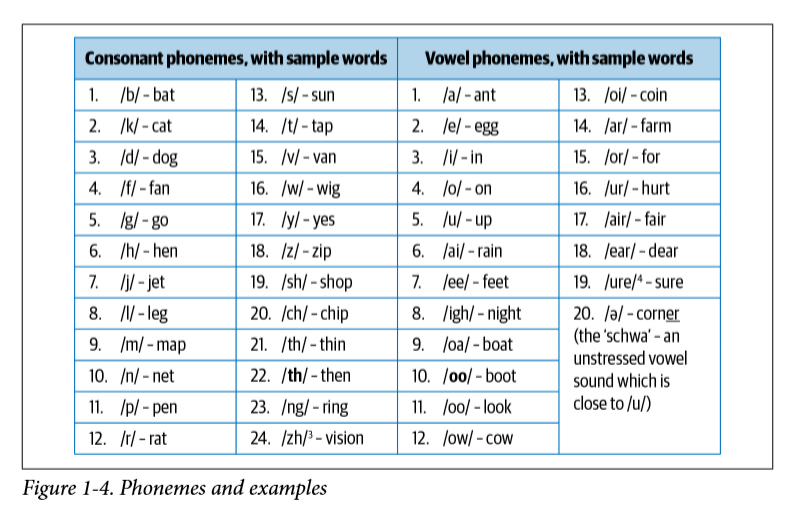

### Morphemes (anlambirim) and Lexemes (sözcükbirim)

A morpheme is the smallest unit of language that has a meaning. It is formed by a combination of phonemes. Not all morphemes are words, but all prefixes and suffixes are morphemes. For example, in the word “multimedia,” “multi-” is not a word but a prefix that changes the meaning when put together with “media.” “Multi-” is a morpheme.

For words like “cats” and “unbreakable,” their morphemes are just constituents of the full word, whereas for words like “tumbling” and “unreliability,” there is some variation when breaking the words down into their morphemes.
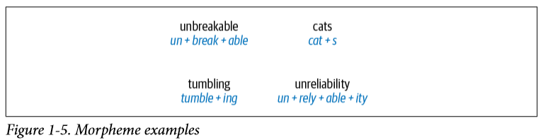
Lexemes are the structural variations of morphemes related to one another by meaning. For example, “run” and “running” belong to the same lexeme form.

### Syntax

Syntax is a set of rules to construct grammatically correct sentences out of words and phrases in a language. Syntactic structure in linguistics is represented in many different ways. A common approach to representing sentences is a parse tree.
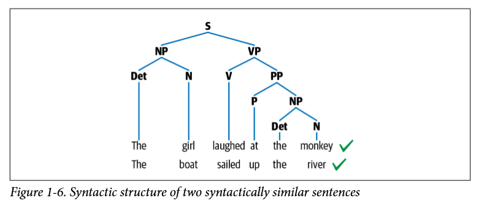

### Context

Context is how various parts in a language come together to convey a particular meaning. Context includes long-term references, world knowledge, and common sense along with the literal meaning of words and phrases.

---

### Machine Learning, Deep Learning, and NLP: An Overview

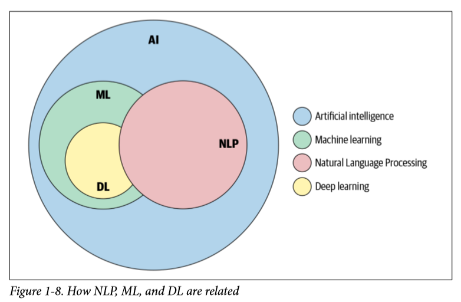

Common in real-world NLP projects is a case of semi-supervised learning, where we have a small labeled dataset and a large unlabeled dataset. Semi-supervised techniques involve using both datasets to learn the task at hand. Last but not least, reinforcement learning deals with methods to learn tasks via trial and error and is characterized by the absence of either labeled or unlabeled data in large quantities.

Any machine learning approach for NLP, supervised or unsupervised, can be described as consisting of three common steps: extracting features from text, using the feature representation to learn a model, and evaluating and improving the model.

## Deep Learning for NLP

- Recurrent Neural Network (RNN)

 Language is inherently sequential. A sentence in any language flows from one direction to another (e.g., English reads from left to right). Thus, a model that can progressively read an input text from one end to another can be very useful for language understanding. Recurrent neural networks (RNNs) are specially designed to keep such sequential processing and learning in mind.
 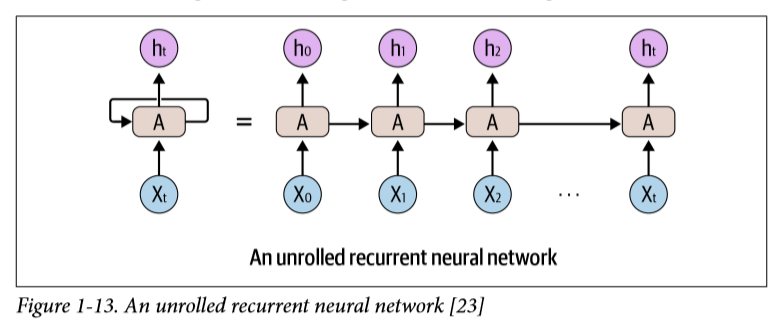

 RNNs are powerful and work very well for solving a variety of NLP tasks, such as text classification, named entity recognition, machine  translation, etc. One can also use RNNs to generate text where the goal is to read the preceding text and predict the next word or the next character.

- Long Short-Term Memory

Despite their capability and versatility, RNNs suffer from the problem of forgetful memory—they cannot remember longer contexts and therefore do not perform well when the input text is long, which is typically the case with text inputs. Long short-term memory networks (LSTMs), a type of RNN, were invented to mitigate this shortcoming of the RNNs. LSTMs circumvent this problem by letting go of the irrelevant context and only remembering the part of the context that is needed to solve the task at hand. This relieves the load of remembering very long context in one vector representation.
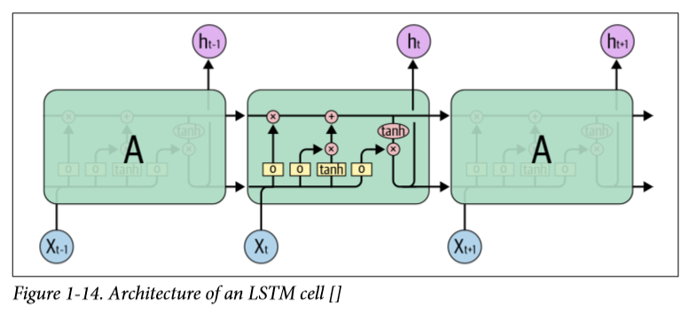

- Convolutional Neural Networks

CNNs have also seen success in NLP, especially in text-classification tasks. One can replace each word in a sentence with its corresponding word vector, and all vectors are of the same size (d) (refer to “Word Embeddings) ”.  Thus, they can be stacked one over another to form a matrix or 2D array of dimension n ✕ d, where n is the number of words in the sentence and d is the size of the word vectors. This matrix can now be treated similar to an image and can be modeled by a CNN. The main advantage CNNs have is their ability to look at a group of words together using a context window.
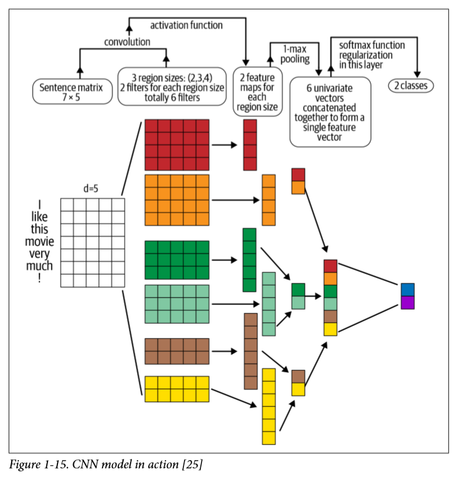

- Transformers

Transformers are the latest entry in the league of deep learning models for NLP. They model the textual context but not in a sequential manner. Given a word in the input, it prefers to look at all the words around it (known as selfattention) and represent each word with respect to its context.

Recently, large transformers have been used for transfer learning with smaller downstream tasks. Transfer learning is a technique in AI where the knowledge gained while solving one problem is applied to a different but related problem. With transformers, the idea is to train a very large transformer mode in an unsupervised manner (known as pre-training) to predict a part of a sentence given the rest of the content so that it can encode the high level nuances of the language in it. These models are trained on more than 40 GB of textual data, scraped from the whole internet. An example of a large transformer is BERT (Bidirectional Encoder Representations from Transformers), shown in Figure 1-16, which is pre-trained on massive data and open sourced by Google.
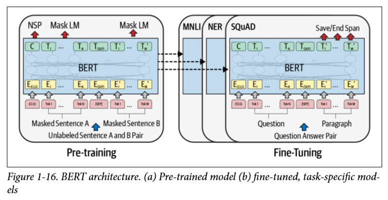

Due to the sheer amount of pre-trained knowledge, BERT works efficiently in transferring the knowledge for downstream tasks and achieves state of the art for many of these tasks.
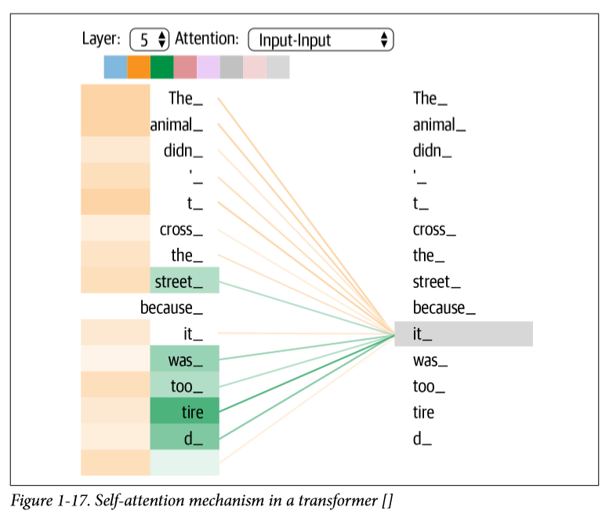

Figure 1-17 illustrates the workings of a selfattention mechanism, which is a key component of a transformer.

- Autoencoders

An autoencoder is a different kind of network that is used mainly for learning compressed vector representation of the input. For example, if we want to represent a text by a vector, what is a good way to do it? We can learn a mapping function from input text to the vector. To make this mapping function useful, we “reconstruct” the input back from the vector representation. This is a form of unsupervised learning since you don’t need human-annotated labels for it. After the training, we collect the vector representation, which serves as an encoding of the input text as a dense vector. Autoencoders are typically used to create feature representations needed for any downstream tasks.
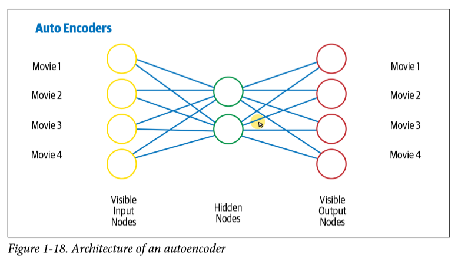

EK!

**Transformerlar Nasıl Çalışır?**
Transformerler, dizi iletimi veya sinirsel makine çevirisi sorununu çözmek için geliştirildi. Bu, bir giriş dizisini bir çıktı dizisine dönüştüren herhangi bir görev anlamına gelir. Buna konuşma tanıma, metinden konuşmaya dönüştürme vb. dahildir.

Ali ve Veli bugün dışarıya çıktılar. Onlar güzel bir gün geçirdiler. Bu cümlede geçen ”onlar” kelimesi Ali ve Veli’ye atıfta bulunmaktadır. Böyle cümleleri çevirmek için, bir modelin bağımlılıkları ve bağlantıları bulunması gerekir. → RNN ve CNN bunun için!

    - RNN
        
        Tekrarlayan Sinir Ağları, içerilerinde bilginin kalmasına izin veren döngülere sahiptir.
        Sinir ağının bir parçası olan  A’nın bazı x_t girişlerini ve h_t çıkışlarını işlediğini görüyoruz. Döngü, bilgilerin bir adımdan diğerine aktarılmasına izin verir.
        RNN, önceki kelimelerin bilgilerini bu bilgiyi kullanabilen ve işleyebilren bir sonraki ağa aktarır.
        İlgili bilgiler ile ihtiyaç duyulan nokta arasındaki boşluk çok büyüdüğünde RNN’ler çok etkisiz hale gelir. Bunun nedeni, bilginin her adımda aktarılması ve zincir ne kadar uzun olursa, bilgilerin zincir boyunca kaybolma olasılığı o kadar yüksektir. Özel bir RNN türü olan LSTM, bu tür bir sorunu çözmeye çalışır.

    - Uzun-Kısa Süreli Bellek (LSTM)
        
        RNN yeni bilgi eklendiğinde, bir işlev uygulayarak mevcut bilgiyi tamamen dönüştürür. Tüm bilgiler değiştirilir ve neyin önemli olup neyin olmadığı dikkate alınmaz. LSTM’ler, çarpma ve eklemelerle bilgilerde küçük değişiklikler yapar. LSTM’ler ile bilgi, hücre durumları olarak bilinen bir mekanizma aracılığıyla akar. Bu şekilde önemli ve çok önemli olmayan şeyleri seçerek hatırlayabilir veya unutabilir.
        
        Genel olarak RNN’lerinde olan sorun LSTM’de de olur, yani cümleler çok uzun olduğunda LSTM’ler hala çok iyi sonuç vermiyor. Bu problemlerden bazılarını çözmek için araştırmacılar, belirli kelimelere dikkat etmek için bir teknik geliştirdiler.
        
        Sinir ağları, verilen bilgilerin bir alt kümesinin bir kısmına odaklanarak ***dikkati*** kullanarak bu aynı davranışı başarabilirler.
        
        **Dikkat**, bir sinir ağında kullanılan bir tekniktir. RNN’ler için, yalnızca tüm cümleyi gizli bir durumda kodlamak yerine, her kelime, kod çözme aşamasına kadar tüm yol boyunca aktarılan karşılık gelen bir gizli duruma sahiptir. Ardından, gizli durumlar RNN’nin her adımında kodu çözmek için kullanılır. 
        
        Ancak tartıştığımız bazı problemler, **dikkat** kullanılarak RNN’ler ile hala çözülmedi**.**

    - CNN
        - Paralelleştirmek için önemsizdir(katman başına).
        - Yerel bağımlılıkları kullanır.
        - Konumlar arasındaki mesafe logaritmiktir.

        CNN’in paralel çalışabilmesinin nedeni, girişteki her kelimenin aynı anda işlenebilmesi ve çevrilecek önceki kelimelere bağlı olmamasıdır. Çıktı kelimesi ile bir CNN için herhangi bir girdi arasındaki mesafe log (N) sırasındadır. Bu, çıkıtdan girişe kadar üretilen ağacın yüklekliğinin boyutudur. 
        CNN, cümleleri çevirirken bağımlılık sorununu çözme konusunda mutlaka yardımcı olmaz. Bu yüzden Transformers yaratıldı, her iki CNN’in dikkat ile birleşimidir.

Paralelleşme problemini çözmek için Transformelar, dikkat modelleri ile birlikte CNN kullanarak sorunu çözmeye çalışırlar. Transformer, hızı arttırmak için dikkati kullanan bir modeldir. Daha spesifik olarak, öz-ilgiyi (self-attention) kullanır.
Dahili olarak, Transformer yukarıdaki önceki modellerle benzer bir mimariye sahiptir. Ancak Transformer, altı kodlayıcı ve altı kod çözücüden oluşur.
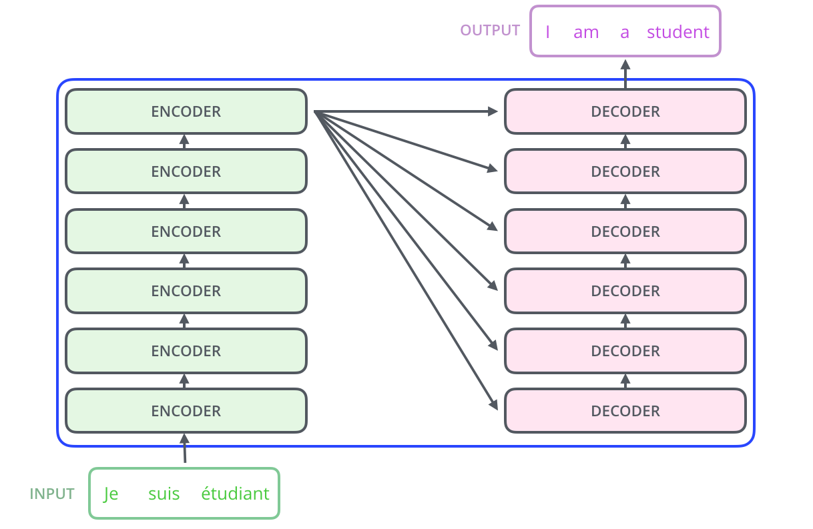

Her kodlayıcı birbirine çok benzer. Tüm kodlayıcılar aynı mimariye sahiptir. Kod çözücüler aynı özelliği paylaşırlar, yani birbirlerine çok benzerler. Her kodlayıcı iki katmandan oluşur: Öz-dikkat ve bir İleri Sinir Ağı beslemesi.
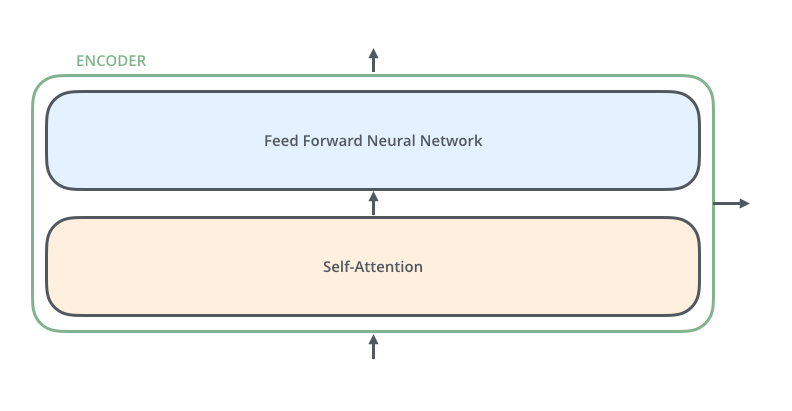

Kodlayıcının girişleri önce bir öz-dikkat katmanından geçer. Kodlayıcının belirli bir kelimeyi kodlarken giriş cümlesindeki diğer kelimelere bakmasına yardımcı olur. Kod çözücü bu iki katmana da sahiptir, ancak aralarında kod çözücünün giriş cümlesinin ilgili kısımlarına odaklanmasına yardımcı olan bir dikkat katmanı vardır.
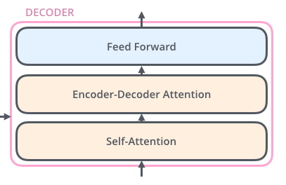

!EK
- **What is Pre-Training in NLP?**
    
*Pre-training in AI refers to training a model with one task to help it form parameters that can be used in other tasks.*

In AI, pre-training immitates the way human beings process new knowledge. That is: using model parameters of tasks that have been learned before to initialize the model parameters of new tasks. In this way, the old knowledge helps new models successfully perform new tasks from old experience instead of from scratch.

5 Essential pre-training technologies:

1. **Word2vec**
    
    Word2vec is a tool created by Google that produces static word embedding. It turns out that the word embedding trained by word2vec has the seemingly magical ability to measure word-to-word similarity.
    
    The word2vec uses is a shallow neural network with each word’s one-hot embedding as its input and output.

2. **ELMo**
    
    ELMo (Embeddings from Language Models) is an AI technology for dynamic word embedding with LSTM. 
    
    Word2Vec is static: no matter what the context, it will not change. This lead to a situation where word2vec’s word embedding can’t handle polysemous words.
    
    But we can adjust the word embedding according to the context to give it a more semantic meaning - which is where ELMo comes into play. It is the idea of dynamically adjusting word embedding according to the current context.

    ELMo’s network architecture uses a two-layer bidirectional LSTM on top of the word embedding layer learned by word2vec.

    ELMo’s pre-training process not only learns word embedding but also learns a two-layer, bi-directional LSTM network structure - both of which have their own roles when facing new tasks.

3. **GPT**
    
    In AI, GPT is a transformer-decoder-based autoregressive language model. The core idea behind the Transformer model is self-attention - the ability to attend to different positions of the input sequenvce to compute a representation of that sequence.

    GPT is a based on the *Transformer decoder.* GPT also uses static word embedding as input, plus a certain number of layers of the Transformer decoder on top of it.

    When fine-tuning specific NLP tasks with supervised learning, GPT - unlike ELMo, which connects to other model layers as feature representations - does not need to re-build new model structures for tasks. Instead, it directly connects the last layer to softmax as the task output layer, then fine-tunes the entire model.

4. **BERT (Bidirectional Encoder Representations from Transformers)**
    
    BERT is a Transformer-encoder-based autoencoder language model.
    
    BERT is a fine-tuning-based and encoder-based method.
    
    BERT changes the unidirectional language model in GPT into a bidirectional one. Instead of using the standart left-to-right prediction of the next word as the target task, BERT proposes two new tasks.
    
    BERT’s first pre-training task is called MLM or Masked Language Model. In the input word sequence of this model, 15% of the words are randomly masked and the task is to predict what they are. What we see in that, unlike previous models, BERT can predict these words from both directions -not just left-to-right or right-to-left.
    
    In addition, in terms of model input, BERT WordPiece embedding is used instead of standart word embedding. Then we input this embedding to the BERT Transformer encoder layer to start the training.

5. **XLNet**
    
    XLNet is an AI technology that inetgrates GPT and BERT.
    
    XLNet introduces us to autoregressive model and DAE (denoise autoencoder) model. 
    
    That is, XLNet tries to introduce the bidirectional language model into the autoregressive language model.